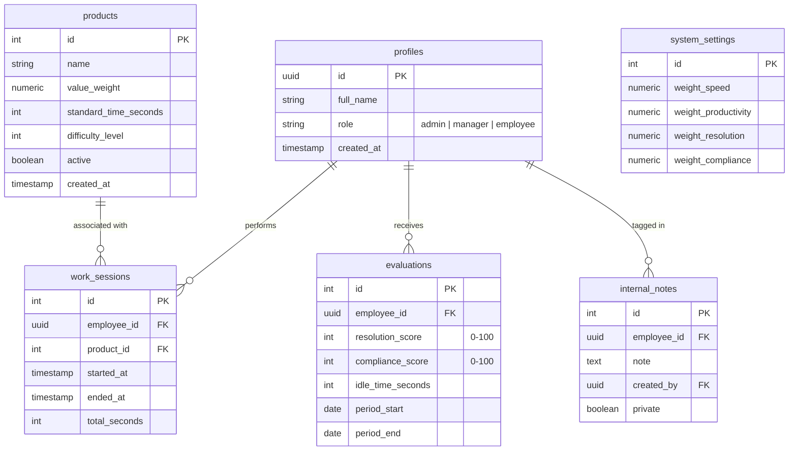

# STATLINE — Technical Brief

## 1. System Objective

A **mobile-first web application** for real-time internal production performance measurement and analysis.

### Core Capabilities:

- **Management:** Register employees and products.
- **Measurement:** Integrated stopwatch for precise time tracking.
- **Analytics:** Automatic calculation of key performance metrics.
- **Visualization:**
  - **Admin:** "Game-style" visual statistics (e.g., player cards).
  - **Manager:** Corporate-style dashboards.
  - **Employee:** Personal evolution and relative performance.
- **Deployment:** 100% web-based (mobile-first), no native app required.

### Core Tech Stack:

- **Next.js 14+** (App Router, no `src/` directory).
- **Supabase** (PostgreSQL, Auth, Realtime).
- **TailwindCSS** for styling.

---

## 2. General Architecture

### Frontend

- **Runtime:** Next.js (App Router).
- **Rendering Strategy:**
  - **Server Components:** Data-heavy views and initial page loads.
  - **Client Components:** Interactive elements (Stopwatch, Realtime subscriptions, Charts).
- **Layout:** Strictly **mobile-first** design.
- **Auth:** Managed via Supabase Auth.

### Backend & Database

- **Database:** Supabase PostgreSQL.
- **Security:** Row Level Security (**RLS**) policies.
- **Realtime:** Supabase Realtime for live updates.
- **Logic:** Critical metric logic resides in **SQL Views** and functions; the frontend acts as a consumer.

---

## 3. User Roles & Features

### [Admin] — "Game Mode"

The most interactive and visual interface, inspired by sports game statistics (e.g., PES/FC cards).

- **Management:** CRUD for Employees and Products.
- **Configuration:** Adjust metric weights and standard production times.
- **Insights:** View full metrics, internal private notes, and trigger metric recalculations.

### [Manager] — "Corporate Mode"

A clean, concise dashboard for high-level monitoring.

- **Dashboard:** General overview and team rankings.
- **Analysis:** Performance by product, evolution over time, and employee vs. average comparisons.
- **Filtering:** Time-based filters for historical data.
- **Access:** No weight configuration or access to private notes.

### [Employee] — "Personal Mode"

A focused dashboard for individual progress.

- **Personal Tracking:** View personal metrics, evolution, and best-performing products.
- **Benchmarking:** Comparison against an anonymous team average.
- **Privacy:** Cannot view data belonging to other employees.

---

## 4. Database Model (schema)



---

## 5. Metrics & Formulas

All calculations are performed via **SQL Views** for consistency and performance.

| Metric            | Formula / Logic                                                                          |
| :---------------- | :--------------------------------------------------------------------------------------- |
| **Speed Score**   | `speed_ratio = (standard_time / real_time)`. Normalized to 0–100 scale.                  |
| **Productivity**  | `SUM(products.value_weight)` per period. Normalized against team average.                |
| **Performance**   | `(Weighted Productivity / Effective Time)`. _Effective Time = Total - Idle_.             |
| **Overall Score** | Weighted sum of Speed, Productivity, Resolution, and Compliance. (Configurable weights). |

### Product Specialization

A specific view (`employee_product_stats`) tracks:

- **Average Speed** per product.
- **Total Completed** items.
- **Efficiency Score** and **Product Rating**.
- _Outcome:_ Reveals where an employee is most efficient (e.g., Pizza: 91 vs. Medialunas: 67).

---

## 6. Technical Implementation Details

### Realtime Subscriptions

The system subscribes to `work_sessions` and `evaluations` to enable:

1.  Live stopwatch updates across devices.
2.  Interactive, real-time rankings.
3.  Instant dashboard refreshes.

### Project Structure (Next.js)

```text
app/
├── (auth)/login/
├── dashboard/
│   ├── admin/
│   ├── manager/
│   └── employee/
├── employees/
├── products/
├── sessions/
└── settings/
components/
├── ui/         # Base shadcn/custom components
├── charts/     # Radar, Bar, Area charts
├── cards/      # "PES-style" player cards
└── stopwatch/  # Real-time tracking logic
lib/
├── supabase/   # Client and Auth helpers
└── utils/      # Roles and formatting
```

### Stopwatch Logic

- **Start:** Inserts `work_session` with `started_at`.
- **Pause:** Updates `total_seconds` accumulation.
- **Stop:** Records `ended_at` and closes the session.
- **Persistence:** State is stored in the DB (sessions with `ended_at IS NULL`) so it persists across page refreshes.

---

## 7. UI / UX Principles

- **Mobile-First:** Large buttons, no infinite horizontal tables, thumb-reachable actions.
- **Visual Gamification:** Radar charts, PES-style cards, large KPI indicators.
- **Clarity:** Modern design tokens (gradients, micro-animations, glassmorphism hints).

---

## 8. Security & Performance

### Row Level Security (RLS)

- **Employee:** Can only `SELECT` their own records.
- **Manager:** Can `SELECT` everything, but cannot `UPDATE`.
- **Admin:** Full access (`SELECT`, `INSERT`, `UPDATE`, `DELETE`).

### Performance Optimization

- **Indexing:** Heavily indexed on `employee_id`, `product_id`, and `created_at`.
- **Materialized Views:** Used for heavy global metrics to avoid real-time calculation bottlenecks.
- **Lazy Calculation:** Metrics calculated per period or on-demand rather than on every render.

---

## 9. Future Roadmap (Scalability)

- Multitenancy (multiple teams/companies).
- CSV/PDF Exporting.
- Automated Performance Alerts.
- AI-driven performance prediction.
- Public API for external integrations.

---

**STATLINE** is not just a decorative app; it is a **quantitative modeling system** for real-time performance. When built correctly, it doesn't just show who is performing better—it identifies exactly where each person should be deployed for maximum efficiency.
